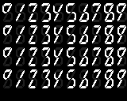

Title: Pixel-Based 6-segment Display
Date: 2025-07-17
Category: Graphics
Authors: Amir 
Summary: I drew a pixelated version of a 6-segment display.
Cover: ../images/6-segment.png
Pixelated: 1

Since I love non-standard displays, the idea that you can use six instead of seven segments in a display is quite interesting to me. So, while browsing around I found [this concept art](https://www.deviantart.com/adamlhumphreys/art/6-Segment-LED-Display-Concepts-520527603) of various versions of 6-segment displays, by the user _adamlhumphreys_. Naturally, using one segment less will also influence the readability of the digits, but I find that the second row, that uses curved digits works around this pretty well. In the end, the digits of standard 7-segment displays dont look too much like the digits in print after all, and I would say that most of their readability is only just recognizability because of their ubiquity. 

What I wanted to have is a pixelated version of these digits, so these are some versions I made that are based around his 6-segment concept. They mainly just differ by how to draw the upper left segment, which you can see in the shape of the digit 4. The first and third row have this segment identical, but they are different in width.

Lastly, I also made a narrow version of the display as well.

I used these digits in making the 6-segment clock on this page. So you can see a live example of how they perform when used to display numbers. As an additional feature, I made clock use the "lowercase 0" for the tens, since I think this fits with the sloped styling of the digits. _Feel free to tell me what you think, and if you find a way to improve on this!_ 
Also, this is how they look on a 0.91'' 128x32 OLED display, I quickly coded a clock with an ESP board for this.
