Title: My Camera Collection
Date: 2025-07-13 15:00
Category: Photos
Authors: Amir
Summary: 
Cover: ../images/cameras/IMG_20250713_152053-min.jpg,../images/cameras/IMG_20250713_161333-min.jpg
 
# Rangefinder cams

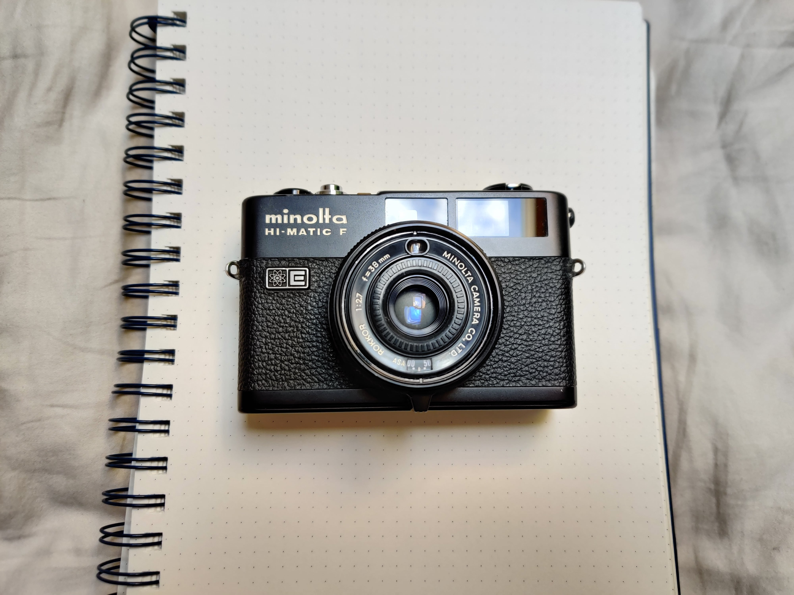
Minolta HI-matic F, ROKKOR f/2.7 38mm -- my first analog camera. This is a simple point and shoot like rangefinder, it automatically selects the shutter speed using its built in CdS meter, you just have to focus manually.

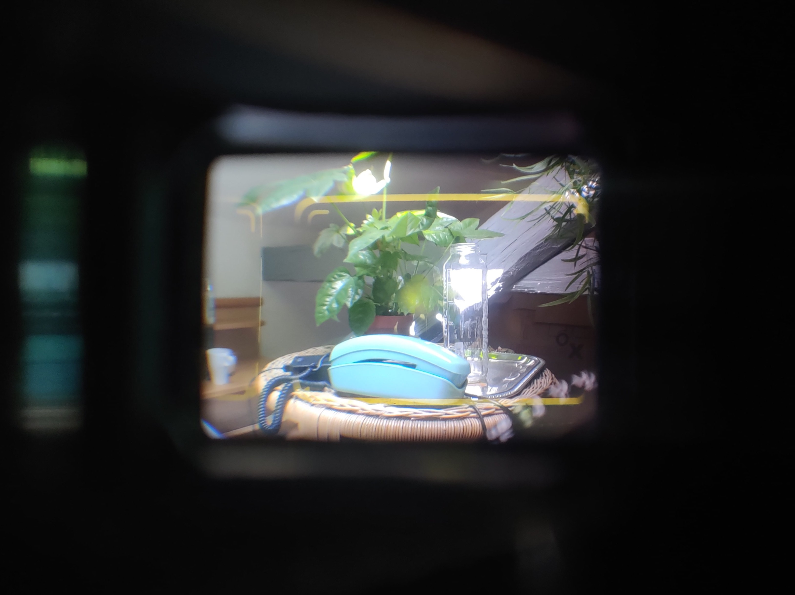
Looking into the viewfinder. While taking these pictures I noticed it is completely out of adjustment.

  

    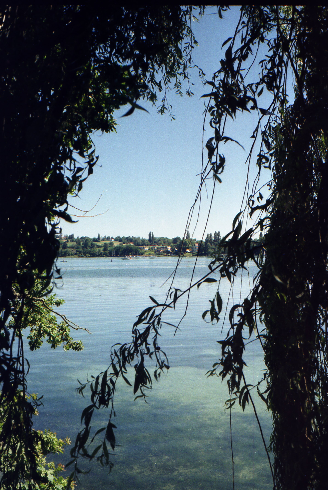
  

  

    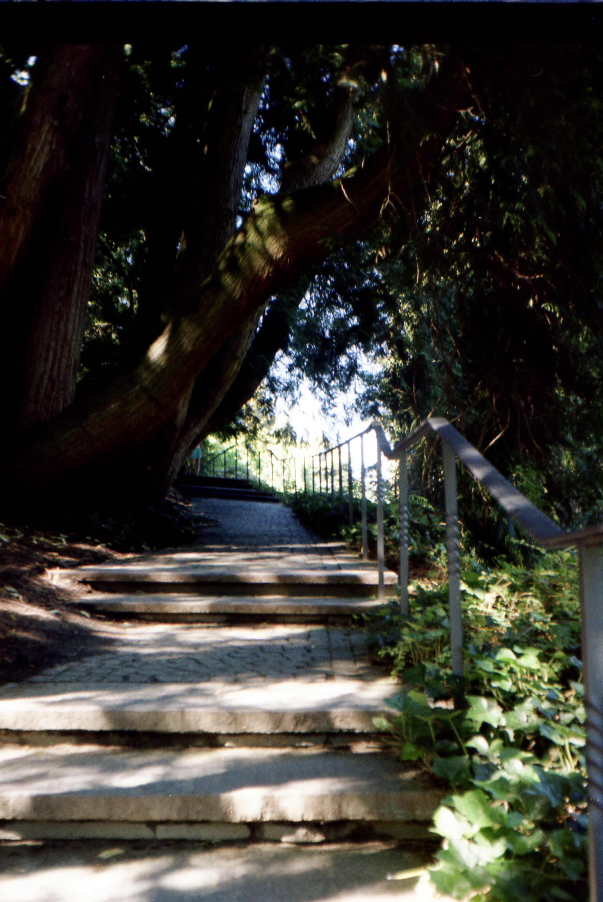
  

Some photos I took using this camera around lake Constanze. Kodak Gold 200

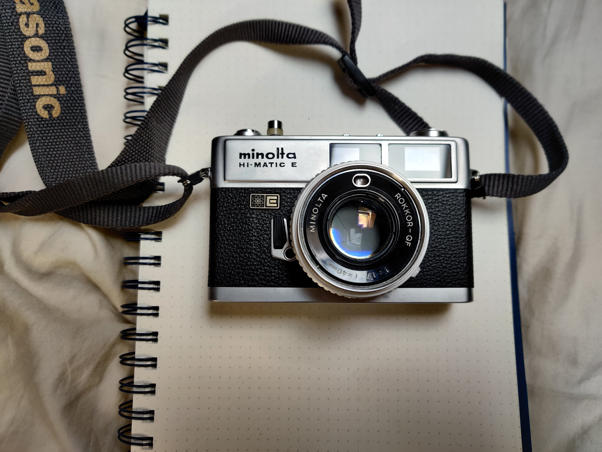
Minolta HI-matic E, ROKKOR-QF f/1.7 40mm. A little bit heftier than the HI-matic F, it has a much faster lens at f/1.7 and also a built in 3sec self-timer.

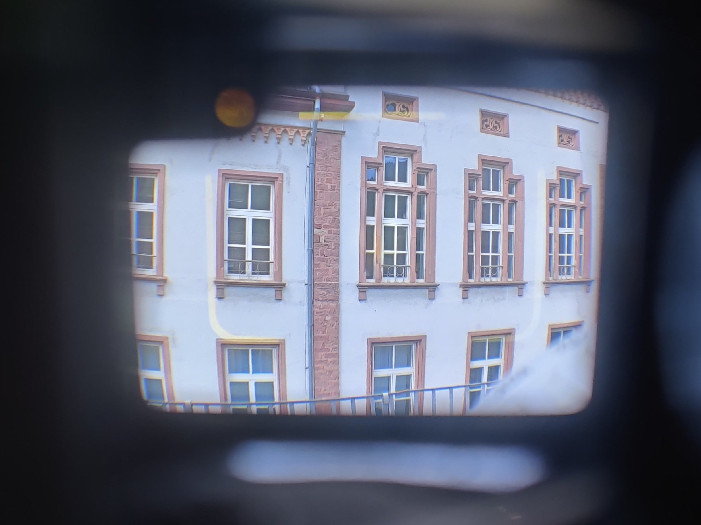
Looking into the viewfinder. All of these viewfinders seem to have a fisheye-like effect on these images, but since you eye has a different field of view this is not visible when actually looking down these.

  

    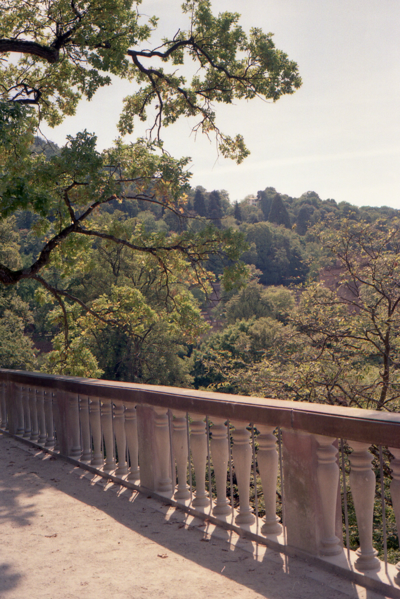
  

  

    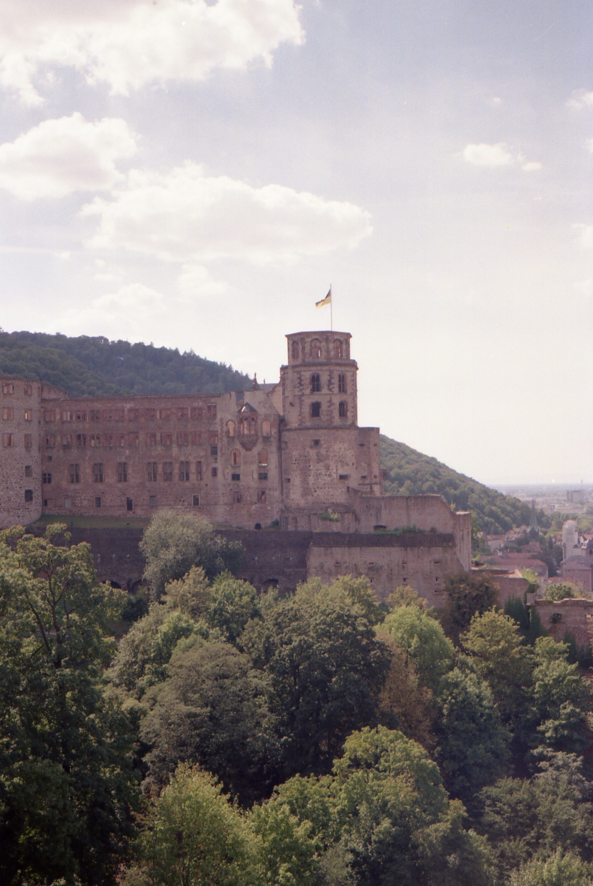
  

Views of Heidelberg castle in summer. I think this was Kodak ColorPlus 200.

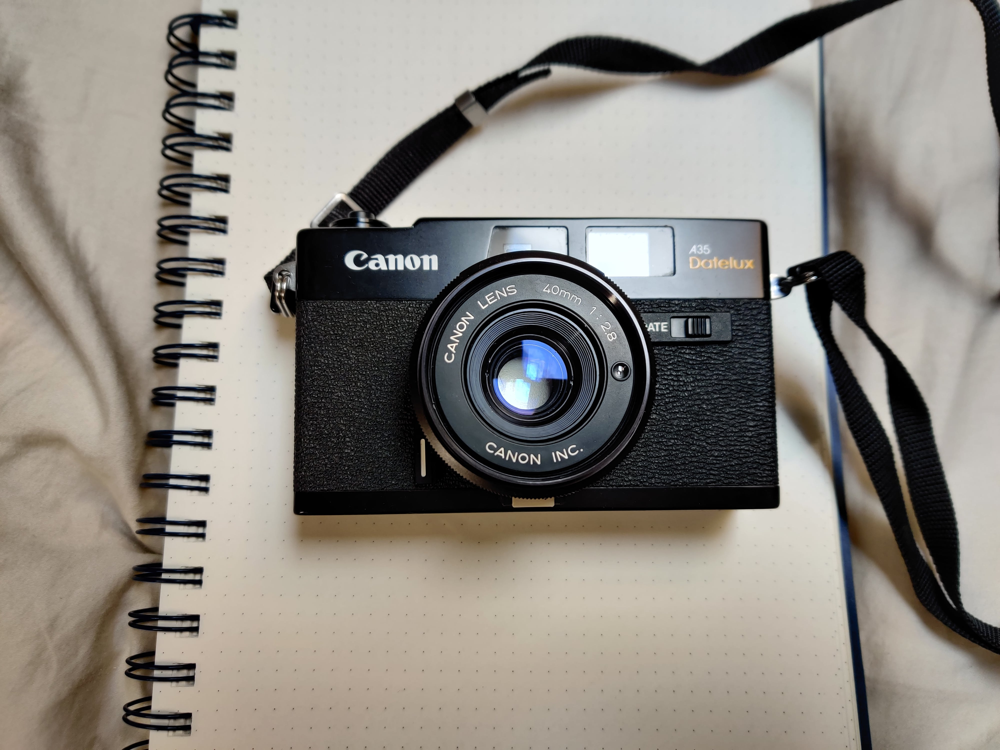
Canon A35 Datelux, Canon lens f/2.8 40mm. This one got date imprinting, self-timer and also a built-in flash, which doesnt work for mine. It also displays the current auto-selected aperture with overexposure and underexposure warnings inside the viewfinder.

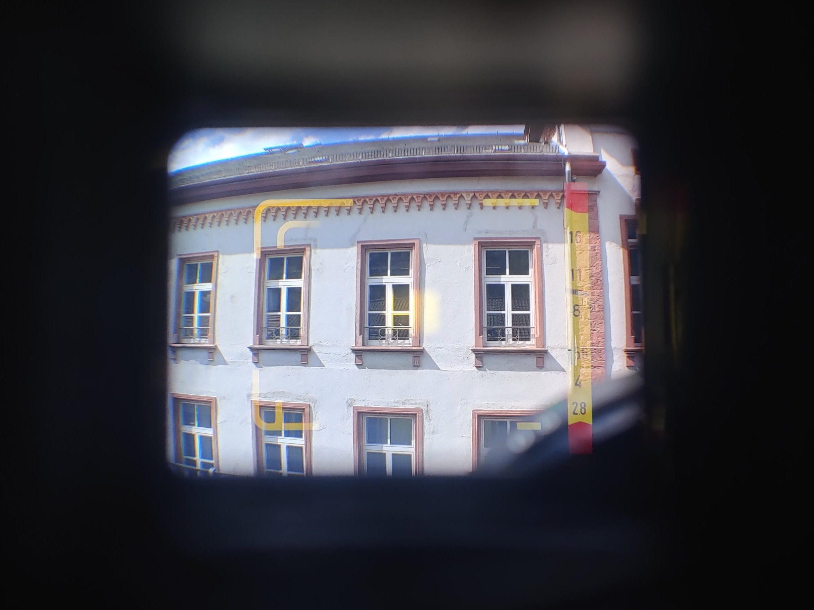
Looking into the viewfinder with the light meter needle visible. 

# SLR cam

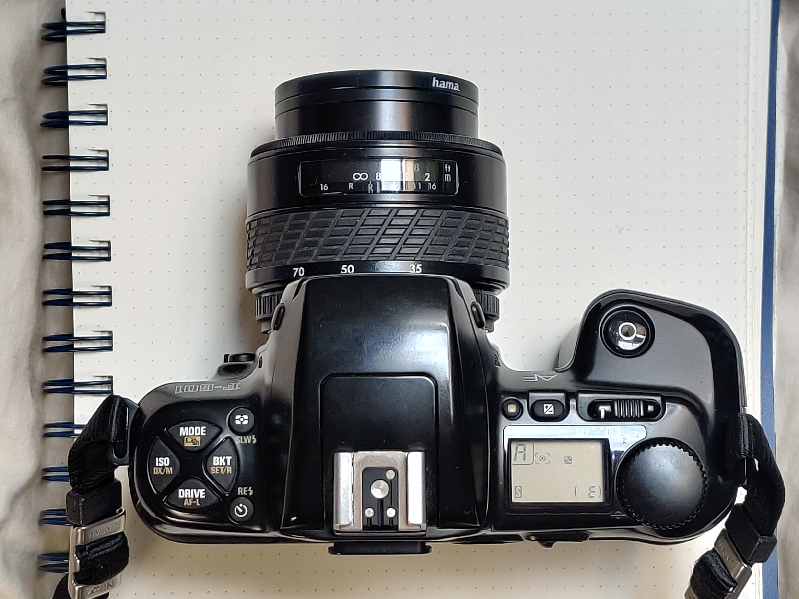
Nikon F-601, Exakta f/3.5-f/4.5 35-70mm zoom lens. By far the most sophisticated of my cameras, I semi-permanently lend this SLR from a friend. It has auto-focus and I use it with a 35-70mm zoom lens.

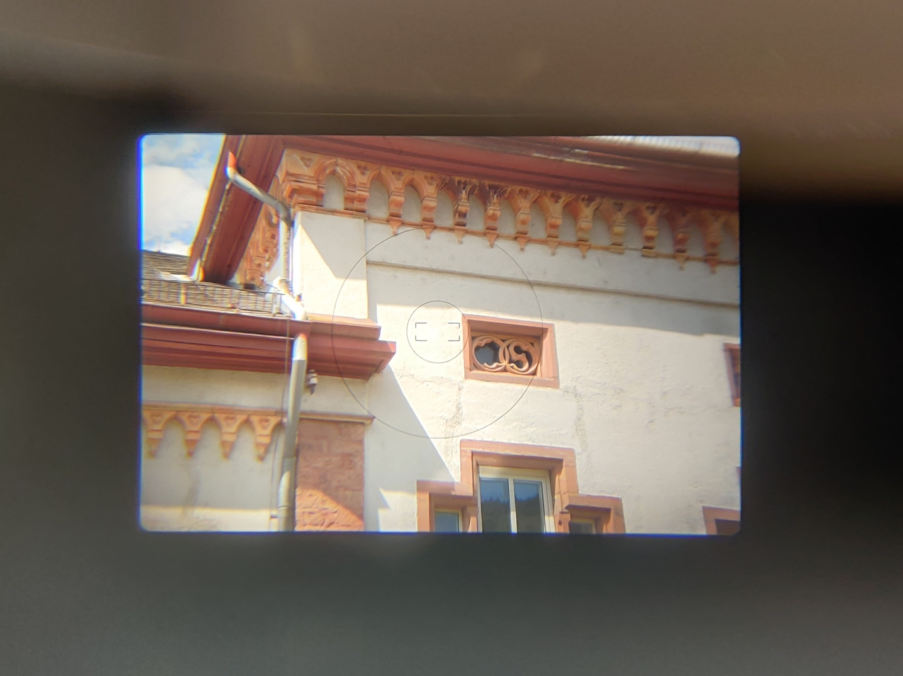
Looking into the viewfinder.

Maybe I will find some images that I shot with it! More coming soon...