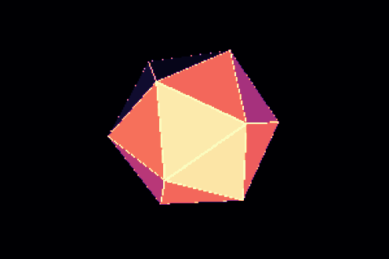
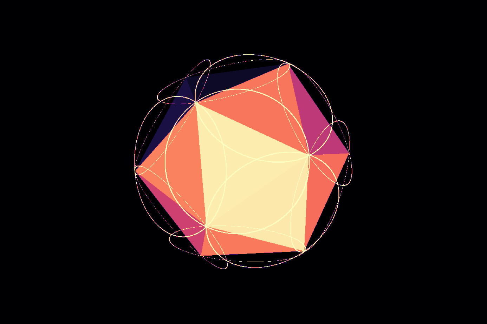
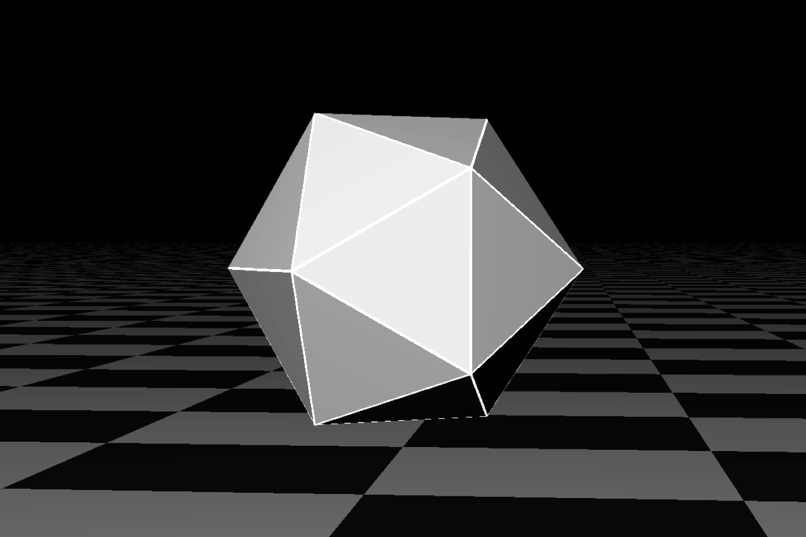
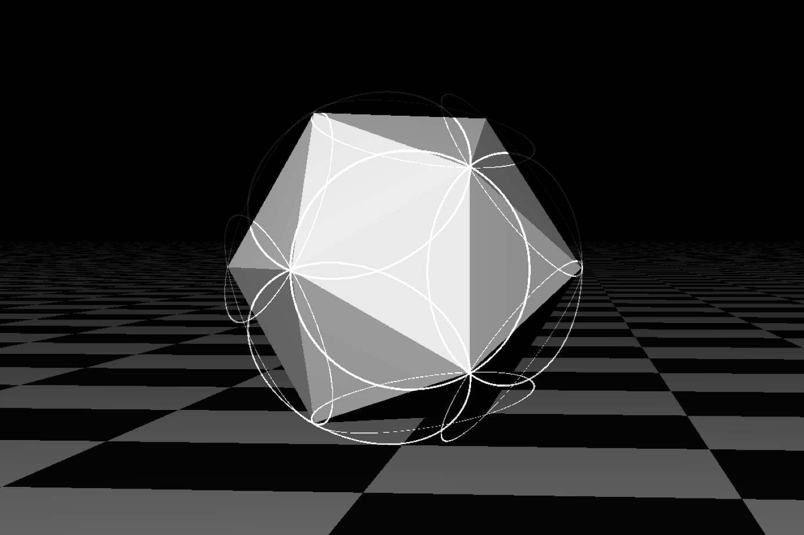

Title: Some renders of an Icosahedron I made
Date: 2025-08-06 17:00
Category: Graphics
Author: Amir
Summary:
Cover: ../images/icosahedron-01-hres-shaded.png

# Icosahedra

This week I was writing another raytracer using PGA (Projective Geoemtric Algebra). Here are some renders of an icosahedron that I made along the way.


First try with low resolution.

Higher resolution. The shading on these is flat shading with a light source at infinity.

For fun, I played with some parameters and discovered that I can render the edges not just straight but also curved. In fact, in this image the circels are the ex-circles around the triangle faces.

Second version with depth attenuation black and white colormap. I also added a ground model that vanishes into the fog. 

Circles!