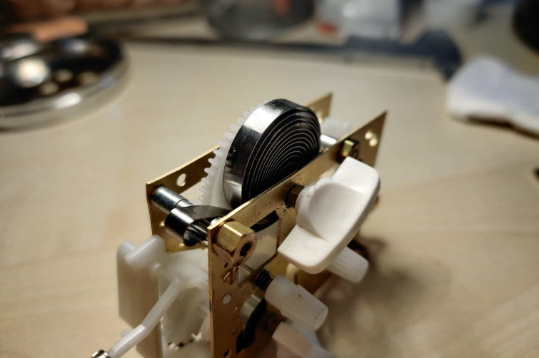
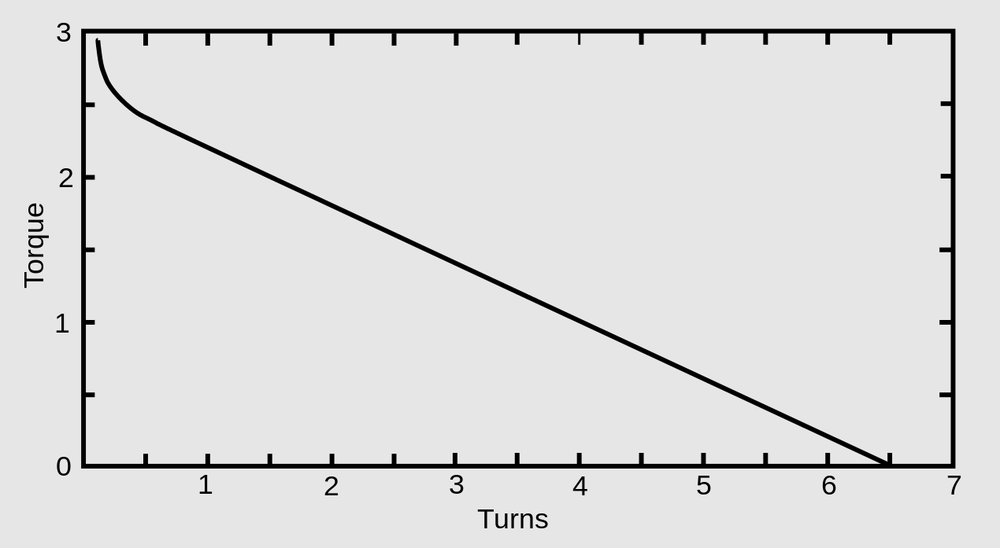

Title: Mechanical Clocks
Date: 2021-09-06
Category: Physics
Tags: mechanical clocks
Authors: Amir J. G. Leidel
Summary: An overview of how mechanical clocks keep time

*This is something I realized that I had no idea about at first. It does not seem to be very mysterious what keeps them going, most often it is a wound up spring or weights on a pulley. But how exactly is this translated into the exactly paced rotation of the timepiece's hands? Why doesn't the pendulum of a clock stop after some time? And also, why do mechanical clocks tick?*

---

To give a broad overview at first, mechanical clocks comprise of an energy storage that most often has to be wound up by hand, if we let this drive the hands of a clock directly it would not go with a constant speed but instead accelerate more and more. To get a motion constant with time some type of oscillator is used that periodically stops the movement of the clock and by that determines its speed. 

## Energy storage 

As mentioned, most mechanical clocks are driven by a main spring or a weight that hangs on a reel, using its potential energy. Main springs are flexible spirals of metal that are able to be wound up and thus save energy. Both springs and weights have in common that they serve to apply a force on an axle giving it a torque. 

Ensuring this force is constant with time is pretty simple for a weight, as long as its mass stays the same, the same force is acting on the reel. A main spring on the other hand generally has a torque that linearly depends on how far it is wound up. 

Now, one method to obtain a constant force spring to drive the clocks is to utilize a longer spring than needed and just use a part of the turns needed to wind it up fully. This, combined with a barrel around the spring that it can press against flattens the torque curve. Looking back at the graph, imagine just unwinding the spring from turn 1 to 3, in this range the torque will remain relatively constant. 

## Oscillators and escapements 

The next thing to do is to control this force. For that an oscillator is used, although this term sounds really technical, an oscillator is just something that vibrates or has something periodical about it when excited. Two examples for that I want to mention here are pendulums and again, spiral springs. These oscillators are linked to the rest of the clock via the escapement. 

In the depicted escapement the pendulum is attached to the anchor above, with every swing it grips into the golden escape wheel to stop it. This is where the ticking of the clock originates from. The wheel is directly connected to the rest of the timepiece through a drive train (a series of gears), thus the speed of the clock is determined now. Note that, after the anchor has stopped the escape wheel, the main spring or weight that drives the clock is still putting a torque on the escape wheel. This torque is then accelerating the escapement again, further note that the faces of the anchor are slanted in such a way that the pendulum gains energy while doing that and this is why the pendulum does not stop even though it experiences friction. 

An escapement can also be constructed with a spiral spring like the one shown above, this balance spring is much smaller than the main spring by comparison, it is just connected to the balance wheel above it. The anchor on the escape wheel to the left is being moved by the balance via a lever that grasps the black pin above the balance wheel. Here too, the spring is experiencing friction and would normally stop after losing enough energy, but with every tick it gets a little bit of momentum from the main spring through the slanted top faces of the escape wheel's teeth. 

The clock is now almost finished, there is an energy storage that feeds this mechanical system and an oscillator that determines the rate at which it does its thing. The only thing left now is to display the time, for that the speed of the axle of the escapement has to be lowered by a gear train. My alarm clock for example has an escape wheel with 16 teeth and I think it does $32 \times 6$ revolutions a minute. The minute hand of a clock on the other hand has to do 1 revolution an hour, or $\frac{1}{60}$ a minute. So there has to be a gear ratio of $32 \times \frac{6}{\frac{1}{60}} = 60 \times 32 \times 6$ between them, canceling out the unit of $\mathrm{min}^{-1}$. Of course this calculation can be extended to fit the hour and second hands as well, using these ratios a clock train can be designed outputting the desired speed for each hand. 
I would like to mention, that clock hands are not the only way to display time on a mechanical clock, one could also imagine using a split-flap display or a mechanical counter. 

---

*That's it, I think so far these are the basic principles a mechanical clock uses. Even though I am not an expert I had much fun writing this and also sorting all the information out in my head in the process. There is of course much more about horology and repairing clocks than I have scratched on here, if I come back to it through some kind of project I will be sure to write about it on here.*